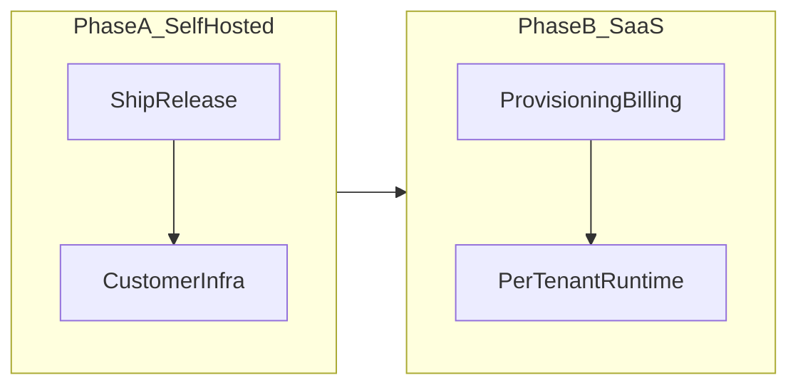

# Go-to-market and production plan

This document is the checklist for turning **Signal Invite Queue Bot** (Kotlin app under `signalbot-kt/` plus Docker/`signal-cli`) into something you can sell. It separates **Phase A — self-hosted commercial MVP** from **Phase B — hosted SaaS MVP**, lists non-code prerequisites, and points to concrete files in this repository today.

Audience: founders, ops, and engineers shipping the first revenue-bearing release.

Related operator docs:

- [`DEPLOY_CLOUD.md`](../DEPLOY_CLOUD.md), [`DOCKER.md`](../DOCKER.md), [`SIGNAL_CLI_SETUP.md`](../SIGNAL_CLI_SETUP.md)

---

## Overview and phased strategy

**Phase A (self-hosted).** Customers run their own deployment (typically Docker plus a persisted `/data` volume). You ship versioned binaries or images, documentation, security updates, and optional paid support or license terms. Complexity stays close to “one stack per buyer.”

**Phase B (hosted SaaS).** You operate infrastructure per customer or per workspace. Monetization aligns with onboarding, metering, Stripe (or equivalent), isolation, backups, observability SLOs, and incident duty.

Phase B should not block Phase A revenue if your offer is intentionally self-hosted-only at launch.

---

## MVP checklist — Phase A (sellable self-hosted)

### Product capability (“works for strangers”)

| Theme | MVP items (mapped to repo) |
|--------|-------------------------------|
| **Safety on first boot** | Operators must never land in production with defaults that effectively train users to expose a weak signing key. Tie release checks to enforcing a strong **`SIGNALBOT_SECRET_KEY`** (see [`signalbot-kt/src/main/kotlin/com/signalbot/web/Server.kt`](../signalbot-kt/src/main/kotlin/com/signalbot/web/Server.kt)). Clarify first-boot behavior: [`docker/entrypoint.sh`](../docker/entrypoint.sh) seeds `config.yaml` from example when missing; document that placeholders are not an acceptable steady state ([`DEPLOY_CLOUD.md`](../DEPLOY_CLOUD.md), [`DOCKER.md`](../DOCKER.md)). |
| **Reliability probes** | Split **liveness** from **readiness**. Today **`/health`** returns a static OK ([`signalbot-kt/src/main/kotlin/com/signalbot/web/Routes.kt`](../signalbot-kt/src/main/kotlin/com/signalbot/web/Routes.kt)). MVP should add **`/ready`** that verifies SQLite usable and optionally that the **`signal-cli` daemon/socket** path used by [`SignalCliClient`](../signalbot-kt/src/main/kotlin/com/signalbot/signal/SignalCliClient.kt) is accepting work. Align Docker **`HEALTHCHECK`** ([`Dockerfile`](../Dockerfile)), Railway ([`railway.toml`](../railway.toml)), and Render ([`render.yaml`](../render.yaml)) once routes exist. |
| **Security hardening** | Prefer placing the UI behind HTTPS and limiting who can reach the port. **`X-Forwarded-For`** is trusted today for login rate limiting ([`Auth.kt`](../signalbot-kt/src/main/kotlin/com/signalbot/web/Auth.kt)); document trusted-proxy-only deployment and tighten behavior if exposed without a sanitizing ingress. Decide on **CSRF** tokens vs explicit risk acceptance for authenticated **POST**s in **`Routes.kt`**. Optional **`Content-Security-Policy`** for the HTML templates in [`Templates.kt`](../signalbot-kt/src/main/kotlin/com/signalbot/web/Templates.kt). |
| **Operator story** | Versioned semver releases anchored in [`signalbot-kt/build.gradle.kts`](../signalbot-kt/build.gradle.kts); changelog discipline in [`CHANGELOG.md`](../CHANGELOG.md). Extend backup/restore beyond the tarball guidance in **`DEPLOY_CLOUD.md`** (“Volume backups”) until your support team can cite a repeatable drill. **`signal-cli` linking remains a human step** locally; [`SIGNAL_CLI_SETUP.md`](../SIGNAL_CLI_SETUP.md) stays the onboarding spine. |
| **Teams** | Buyers often expect more than one admin. Options: mounted config with multiple **`username`/hash pairs**, or SQLite **`users` table + bootstrap/`create-admin` CLI**, building on [`Database.kt`](../signalbot-kt/src/main/kotlin/com/signalbot/store/Database.kt) / Exposed migrations. Optional **roles** (e.g. read-only moderator vs full approval). |
| **Supportability** | Document log levels (**`docker/entrypoint.sh`** mentions `SIGNALBOT_LOG_LEVEL`). Optionally add structured JSON logs, **`X-Request-ID`** propagation in [`Server.kt`](../signalbot-kt/src/main/kotlin/com/signalbot/web/Server.kt), and an authenticated **`/api/diagnostics`** exposing build/version and sanitized config—not secrets. |
| **Quality bar** | Keep Gradle tests ([`.github/workflows/test.yml`](../.github/workflows/test.yml)). Add Dependabot/Renovate for dependency freshness. Optionally run container scans before tagging **`signalbot:*`** releases. |

### Commercial / legal (before invoicing Phase A customers)

These are requirements even when you only ship binaries.

- **Terms and SLA.** State limits clearly: uptime is the customer’s platform plus your software; **`signal-cli` and Signal’s network** sit outside full control—upstream breakage or policy change can break workflows.
- **Privacy and data.** State what rests on disk: **`SIGNALBOT_DB`** SQLite paths and metadata in **[`MessagedStore`](../signalbot-kt/src/main/kotlin/com/signalbot/store/MessagedStore.kt)**; **`/data/signal-cli`** cryptographic material. Operators need a data-handling summary for DPIA-lite conversations.
- **Trademark and naming.** Avoid implying official affiliation with Signal; use factual language (“supports Signal moderation workflows via unofficial integration”) if counsel agrees.
- **Licensing.** This repo declares MIT ([`LICENSE`](../LICENSE)) for your code paths; **`signal-cli` is rebuilt and shipped inside the Dockerfile** ([`Dockerfile`](../Dockerfile)); GPL/third-party coupling requires **explicit legal review** before you promise “closed-source SKU” bundles.

---

## MVP checklist — Phase B (hosted SaaS revenue)

Phase B is a **separate milestone** from Phase A. Minimum expectations before charging for “we host it”:

- **Isolation:** Separate secrets, persisted volumes or DBs per tenant; no cross-customer leakage.
- **Provisioning:** repeatable path from “paid” to runnable stack—often **one container + `/data` per customer** is the pragmatic first SaaS shape given **[`docker/entrypoint.sh`](../docker/entrypoint.sh)** coupling **SQLite + embedded `signal-cli` session**.
- **Billing.** Stripe Checkout or subscription webhooks tying subscription state to service lifecycle.
- **Onboarding.** Either deep-link docs or wizard that never stores Signal keys in plaintext support tickets accidentally.
- **Observability and ops.** Central logs/metrics/alerts beyond single-node stdout rotation.
- **Backups / DR.** Scheduled snapshots tested at least quarterly.
- **Abuse.** Handle spam signups or payment disputes without manual-only firefighting—runbooks and kill switches.

A **lighter Phase B MVP** deliberately mirrors Phase A topology: automate “Stripe customer ⇒ deploy one Railway/Render‑style stack with env + volume”—before investing in shared multi‑tenant pooling.

Architectural reminder: **`MessagedStore` + SQLite** and **`signal-cli` account data** anchor each deployment to filesystem state ([`MessagedStore.kt`](../signalbot-kt/src/main/kotlin/com/signalbot/store/MessagedStore.kt), **`entrypoint.sh`**). Scaling to many workspaces on fewer hosts without one-N containers is **not assumed** before significant redesign.

---

## Recommended engineering sequence

Work can overlap with contracting; this order balances risk reduction and demos:

1. **Release discipline.** Semver Git tags matching `signalbot-kt` version; documented registry or artifact location (Docker Hub, GHCR, private registry policy).
2. **Production defaults.** Refuse startup or refuse external bind unless **`SIGNALBOT_SECRET_KEY`** is strong when admin credentials are configured (**`Server.kt`**). Implement **`/ready`** and point platform probes at it (**`Dockerfile`**, **`railway.toml`**, **`render.yaml`**).
3. **Forwarded headers.** Document and optionally implement trusted-proxy rules for **`X-Forwarded-For`** (**`Auth.kt`** plus ingress snippets for Railway/nginx/Traefik).
4. **CSRF.** Add tokens OR publish explicit risk acceptance for moderator UI **POST**s (**`Routes.kt`** / **`Templates.kt`**).
5. **Multi-user auth.** Prefer SQLite **`users` + bootstrap subcommand on `signalbot.jar`** over ever-growing env strings (**`Database.kt`**, **`Main.kt`**).
6. **Dependency automation.** Dependabot weekly PRs (+ optional `./gradlew dependencyUpdates`).
7. **Phase B spike.** Script “Stripe paid ⇒ terraform/Railway API ⇒ one deployment per customer”; only then widen toward multi‑tenant pooled compute.

[`Main.kt`](../signalbot-kt/src/main/kotlin/com/signalbot/Main.kt) documents process shape (`run` vs `ui` vs headless)—keep packaging contracts stable while hardening Phase A items.

---

## Appendix: risk traceability

| Risk area | Repository hook |
|-----------|----------------|
| Cookie signing defaults | [`Server.kt`](../signalbot-kt/src/main/kotlin/com/signalbot/web/Server.kt), env **`SIGNALBOT_SECRET_KEY`** |
| Login + brute-force pacing | [`Auth.kt`](../signalbot-kt/src/main/kotlin/com/signalbot/web/Auth.kt), [`Routes.kt`](../signalbot-kt/src/main/kotlin/com/signalbot/web/Routes.kt) |
| API surface authorization | **`requireAuth*`** helpers in **`Routes.kt`** |
| Persisted moderator state | [`Database.kt`](../signalbot-kt/src/main/kotlin/com/signalbot/store/Database.kt), [`MessagedStore.kt`](../signalbot-kt/src/main/kotlin/com/signalbot/store/MessagedStore.kt) |
| Process lifecycle + container wiring | [`Main.kt`](../signalbot-kt/src/main/kotlin/com/signalbot/Main.kt), [`docker/entrypoint.sh`](../docker/entrypoint.sh) |